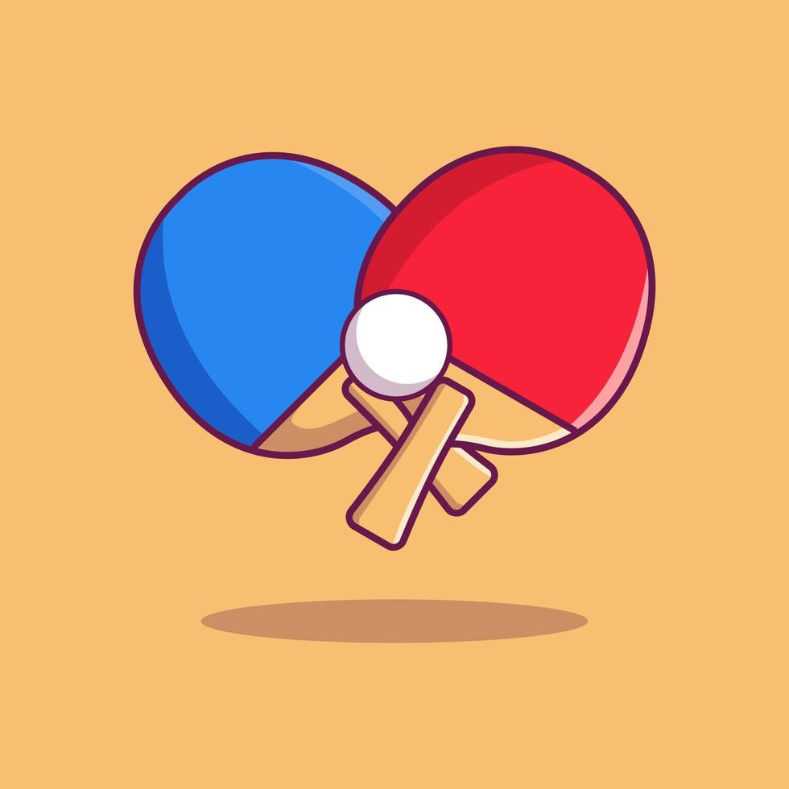

#         "PING-PONG"

### PROYECTO PARA LA CLASE DE PROGRAMACIÓN AVANZADA

## Hecho Por:

Leonardo Isaac González Yáñez, 22310187

Luciano Alejandro Gómez Muñoz, 22310214

    
    INSTRUCCIONES:

        + Jugador uno se mueve con las teclas w y s.
        + Jugador dos se mueve con las flechas arriba y abajo.
        + Presiona Esc para cerrar el juego.
